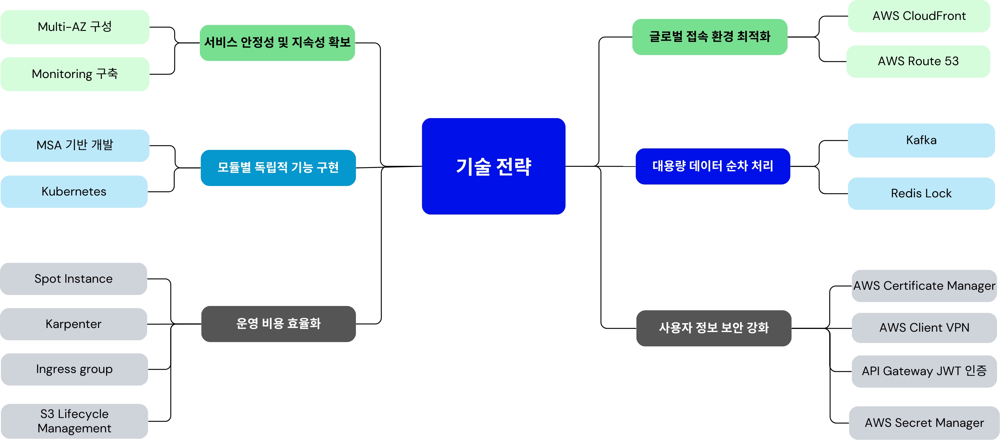
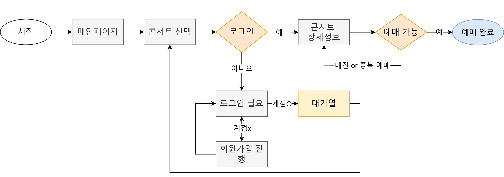
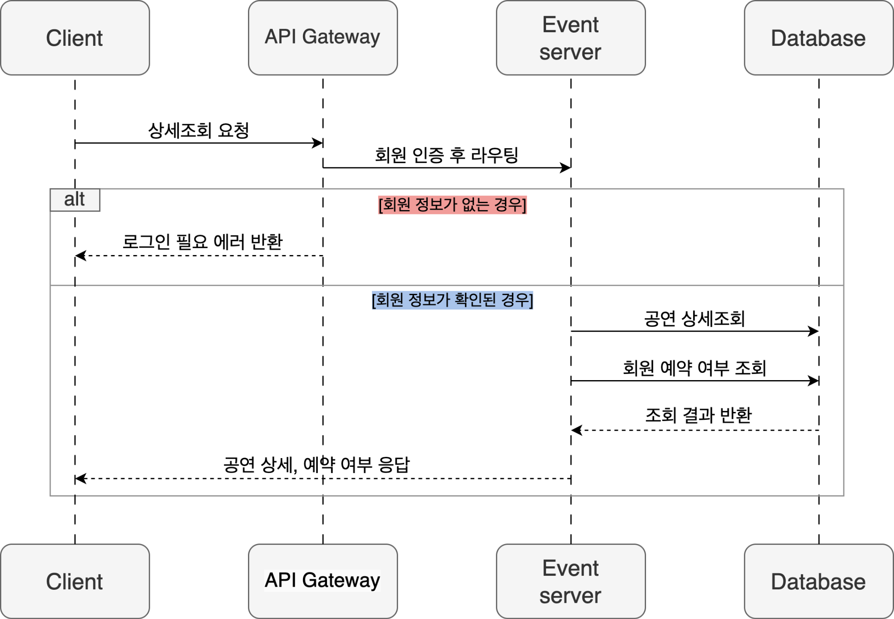
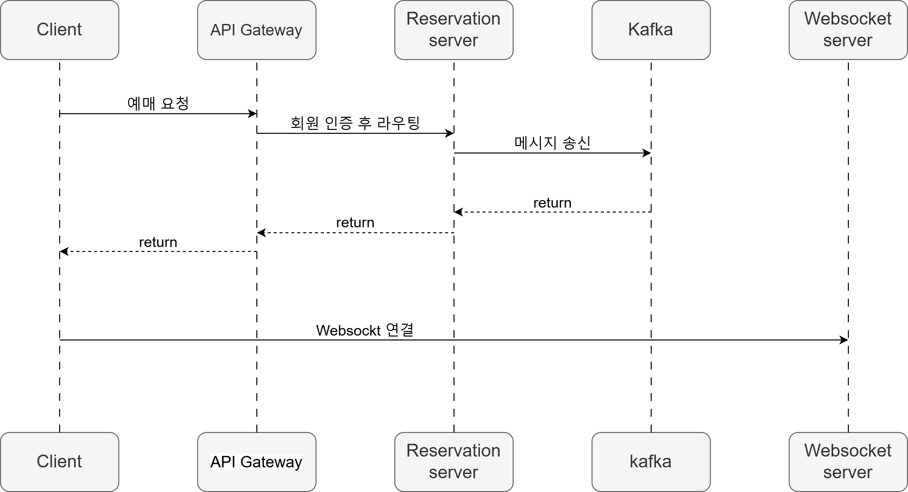
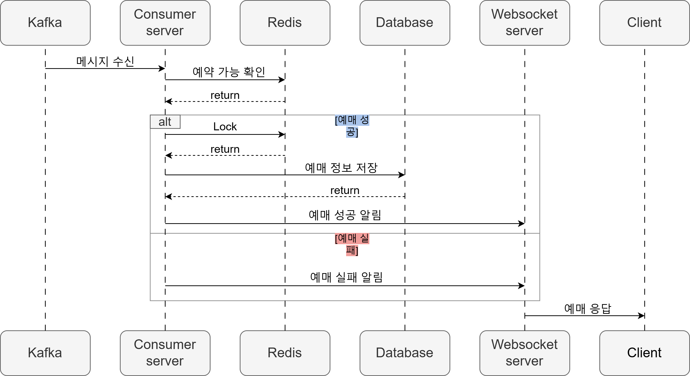
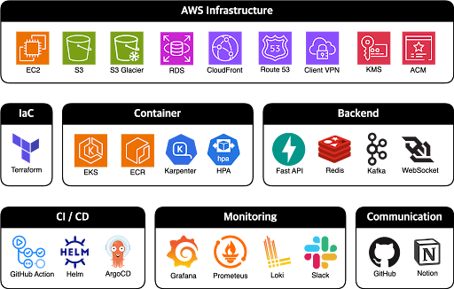
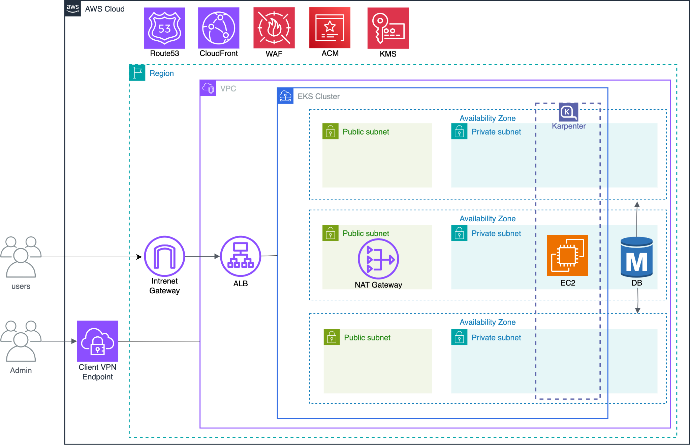

### 바로티켓 | gmmt| 대규모 부하 처리를 위한 티켓팅 시스템 ✅

 

## 📝 요구사항
>

- 서비스 안정성 및 지속성 확보
- 모듈별 독립적 기능 구현
- 운영 비용 효율화
- 사용자 정보 보안 강화
- 글로벌 접속 환경 최적화
- 대용량 데이터 순차 처리
 

> ### 기술 전략

 

 

## 🗂️ APIs

> ### User Flow

 

> ### 공연 상세 조회

 

> ### 공연 예매
#### 예매 요청

 

#### 예매 승인

 

## ⚙ 기술 스택

 

## 🛠️ 프로젝트 아키텍쳐

 

 

## 🤔 기술적 이슈와 해결 과정
- 

 

## 💁‍♂️ 프로젝트 팀원
|FE|FE|BE, CI/CD|BE, Monitoring|
|:---:|:---:|:---:|:---:|
|||||
|[심상호](https://github.com/simsangho6448)|[박수환](https://github.com/sh167603)|[명소이](https://github.com/myeongsoyi)|[김건휘](https://github.com/kuni4210)|
