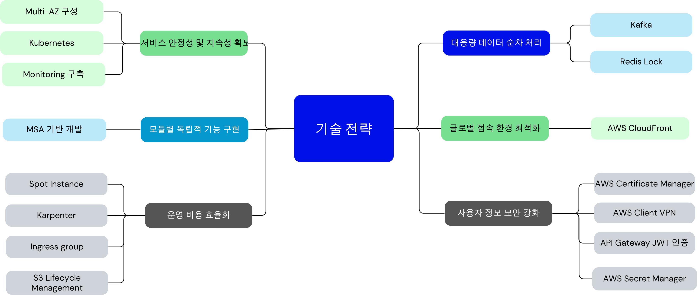
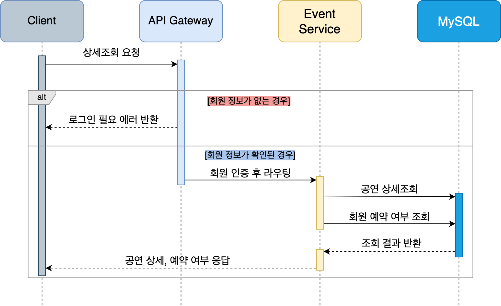
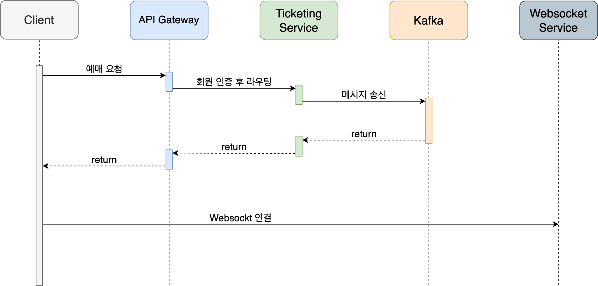
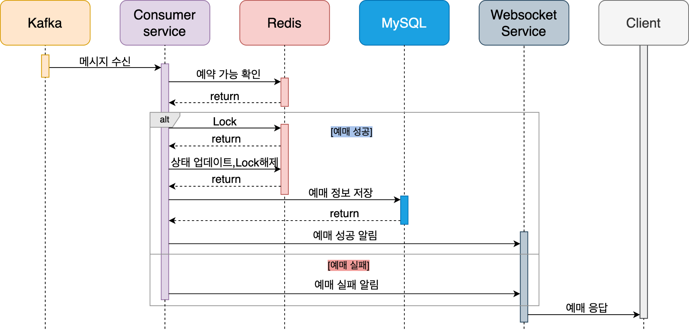
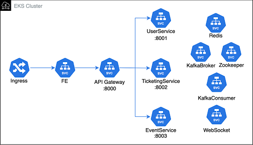
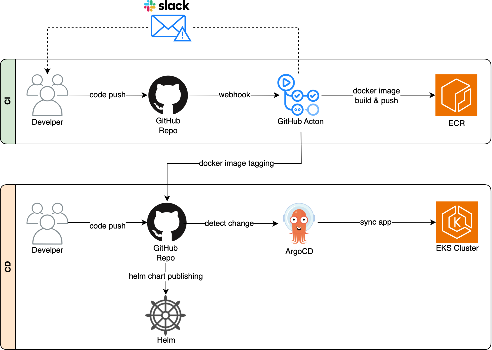

### 바로티켓 | gmmt| 대규모 부하 처리를 위한 티켓팅 시스템 ✅

 

## ✨서비스 소개

> - 대용량 부하를 처리할 수 있는 티켓팅 서비스
> - 글로벌 사용자 모두를 위한 빠르고 안정적인 티켓팅 서비스
> - 운영 편의성을 가진 티켓팅 서비스

## 목차
1. [서비스 소개](#서비스-소개)
1. [요구사항](#-요구사항)
    - [기술전략](#기술-전략)
1. [주요 기능](#️-주요-기능)
    - [User Flow](#user-flow)
    - [공연 상세 조회](#공연-상세-조회)
    - [공연 예매](#공연-예매)
1. [기술 스택](#-기술-스택)
1. [프로젝트 아키텍처](#️-프로젝트-아키텍쳐)
    - [Kubernetes](#쿠버네티스)
    - [Monitoring](#모니터링)
    - [CI/CD](#cicd)
1. [프로젝트 팀원](#️-프로젝트-팀원)

## 📝 요구사항

- 서비스 안정성 및 지속성 확보
- 모듈별 독립적 기능 구현
- 운영 비용 효율화
- 사용자 정보 보안 강화
- 글로벌 접속 환경 최적화
- 대용량 데이터 순차 처리
 

> ### 기술 전략

 

 

## 🗂️ 주요 기능

> ### User Flow

 

> ### 공연 상세 조회

 

> ### 공연 예매
#### 예매 요청

 

#### 예매 승인

 

## ⚙ 기술 스택

 

## 🛠️ 프로젝트 아키텍쳐

 

> ### 쿠버네티스

 

> ### 모니터링

 

> ### CI/CD

 
 

 

## 💁‍♂️ 프로젝트 팀원
||||||
|:---:|:---:|:---:|:---:|:---:|
|[심상호](https://github.com/simsangho6448)|[박수환](https://github.com/sh167603)|[명소이](https://github.com/myeongsoyi)|[김건휘](https://github.com/kuni4210)|[bf01863644](https://github.com/bf01863644)|
